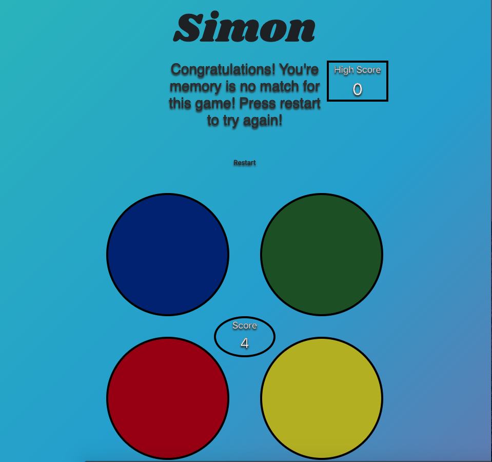

# Simon

----
### By: Samuel Trahan

------------------------
### _Description_

A game of flashing colors in which the player must repeat random sequences of colors by pressing the color buttons in the correct order.

-------

### _Technologies Used_

HTML
CSS
JAVASCRIPT
GitHub
Google Fonts

------

### Getting started

The user picks a difficulty, the game starts when a difficulty is selected.  The game will start with a random color being flashed to the user, the user must press the color that was flashed for the game to continue.  After each round completed the number of colors flashed increases by one.  The game ends when the user cannot repeat the color sequence back, or reaches the end of the color sequence.

## Click [here]() to play the game.
-----

## _ScreenShots_

 

-------
## _WireFrame_

------

## _Improvements_
- Add more circles when difficulty is chosen
- Decrease the time between turns based upon difficulty chosen
- Give the game a theme to choose before difficulty is selected
- Make more than one light flash for harder difficulties
- Add music to the background.
  

  -----

  ## _Credits_

  Background: [Manuel Pinto](https://1stwebdesigner.com/15-css-background-effects/)

